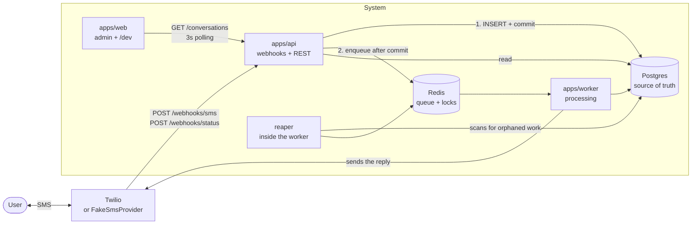
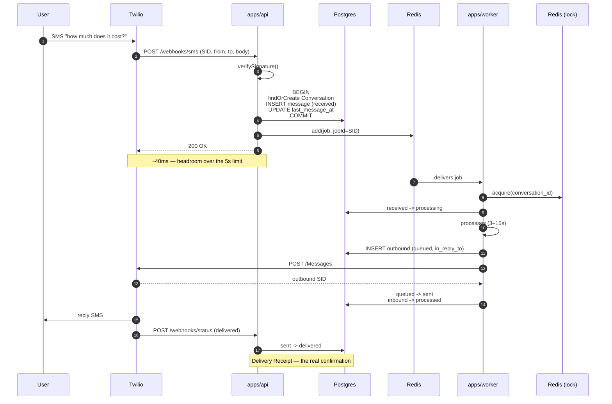
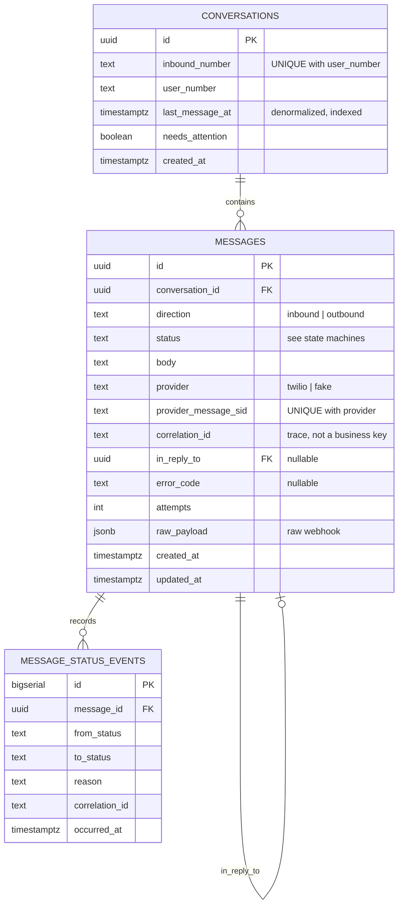
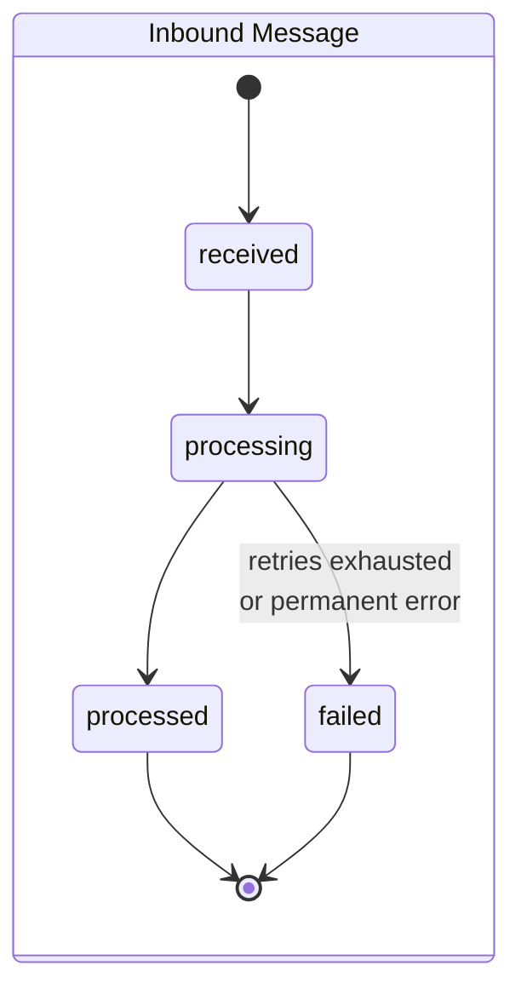
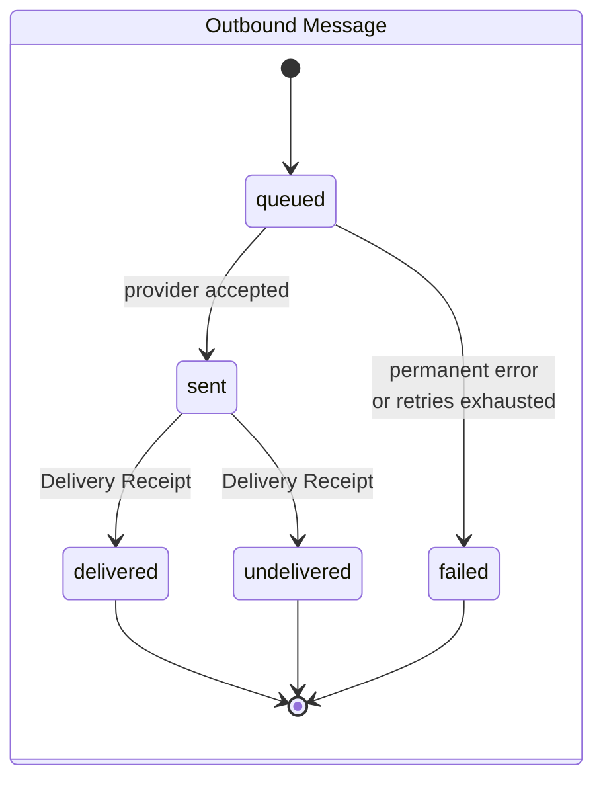

# Architecture — Conversational SMS

The sections below follow, in order, the eight points requested in the [brief](./docs/brief.md).
Every significant decision has an ADR in [`docs/adr/`](./docs/adr/) with the full reasoning and
the rejected alternatives; no answer here depends on opening one.

Domain vocabulary (Conversation, Inbound Message, Delivery Receipt, Failure Notice…) lives in
[CONTEXT.md](./CONTEXT.md). Supporting diagrams in [docs/diagrams.md](./docs/diagrams.md).

---

## 1. System architecture

Four execution units, one pnpm workspace:

| Unit | Responsibility | Why it is separate |
|---|---|---|
| `apps/api` | Twilio webhooks, admin REST | Sub-second latency; scales with inbound traffic |
| `apps/worker` | Consumes the queue, processes, sends SMS | Occupies 3–15 s per job; scales with backlog |
| `apps/web` | Next.js + Tailwind admin, plus the `/dev` page | Read-only against the API |
| `packages/core` | Pure domain: entities, use cases, interfaces | No I/O, no framework — testable without infrastructure |



`apps/worker` hosts two consumers and the reaper in the same process: the processing queue and
the Failure Notice send queue, which is separate and low priority (see §4 and ADR-0006).

**Related ADRs:** [0003](./docs/adr/0003-worker-as-separate-process.md) (worker as a separate
process), [0002](./docs/adr/0002-postgres-and-redis-no-mongo.md) (Postgres + Redis).

---

## 2. Handling the 5-second webhook timeout

The webhook handler processes nothing. It does three things and answers:

1. verifies the `X-Twilio-Signature` header (enabled alongside the real provider; switched off by
   config when `FakeSmsProvider` is active);
2. resolves the Conversation and writes the Inbound Message as `received`, in one transaction;
3. **after the commit**, enqueues the job and returns `200`.

The whole path is database I/O plus an `LPUSH` — tens of milliseconds, with enormous headroom
against the 5 s limit. The 3–15 s of processing happen in another process, and the user receives
the reply as a new message, not as an HTTP response body.



A deliberate detail: `sent` means "Twilio accepted it", not "it reached the handset". Only the
**Delivery Receipt** moves it to `delivered` or `undelivered`. Stopping at `sent` would be
treating API acceptance as delivery.

---

## 3. How processing is decoupled

A queue (BullMQ over Redis) sits between `apps/api` and `apps/worker`, in **separate processes**.
The separation is physical, not merely modular: running processing as background work inside the
API would keep the resource coupling — a burst of slow messages consumes the event loop and the
database connections the webhook needs, and the 5-second ack goes with them, even when the code
looks decoupled.

What the separation buys:

- **Independent scaling.** A growing backlog is `--scale worker=8`; growing inbound traffic is
  more API replicas. Different bottlenecks.
- **Isolated failure.** A downed worker does not stop ingestion: messages keep being accepted and
  persisted, and are processed when it comes back.
- **Order preserved within a thread.** The worker acquires a Redis lock keyed by
  `conversation_id` before processing; whoever misses it returns the job with a short delay. At
  most one job in flight per Conversation, global concurrency unchanged
  ([ADR-0007](./docs/adr/0007-per-conversation-serialization.md)).

On the "message ordering is not guaranteed" constraint, the stance is explicit: we process in
**arrival order**, serialize per Conversation so replies do not trample each other, and accept
that arrival order may differ from send order. Reordering by provider timestamp would mean
holding a message while waiting for an earlier one that may never arrive; total ordering exists
only with a wait window, and a wait window is guaranteed latency bought to defend against a rare
case.

What processing *does* sits behind the `MessageProcessor` interface. The current implementation
is rule-based and deterministic, with a simulated 3–15 s delay. Swapping in an LLM is swapping
the implementation — the rest of the design (asynchrony, retries, ordering) exists precisely
because slow processing is the normal case, not the exception.

---

## 4. Preventing duplicate processing (idempotency)

Two layers, with different jobs
([ADR-0004](./docs/adr/0004-two-layer-idempotency.md)):

| Layer | Mechanism | Role |
|---|---|---|
| Database | unique index on `(provider, provider_message_sid)`; `INSERT … ON CONFLICT DO NOTHING` | **The guarantee.** Survives total loss of Redis |
| Queue | `jobId = provider_message_sid` | **The shortcut.** Avoids work in the common case |

The queue layer alone is not enough: a Redis flush would reopen the door to duplicates. The
database layer alone is enough, but pays one extra round-trip on every redelivery.

**Redelivery never resends.** If Twilio redelivers an already-processed SID, we answer `200` and
stop — even if the corresponding Outbound Message is not yet `delivered`. The webhook has no
information to tell "the reply never went out" from "the reply went out and Twilio merely
repeated the notification"; treating redelivery as a possible failure sends the user a duplicate
SMS. The trade-off is asymmetric and deliberate: **we prefer a late reply to a duplicate reply.**
Resending is the worker's retry responsibility, since it knows the real outcome of the send call.

The outbound path is idempotent by key as well: the Outbound Message row is inserted as `queued`
**before** the provider call, and our own row id travels as the idempotency key on that request
([ADR-0010](./docs/adr/0010-outbound-row-before-provider-call.md)). If the worker dies between
`POST /Messages` and writing the result, the retry finds the `queued` row and reconciles it
instead of creating another. The rule holds on both sides: the database records the intent before
the side effect.

Full sequence in
[docs/diagrams.md §5](./docs/diagrams.md#5-duplicate-webhook-delivery).

---

## 5. Ensuring messages are not lost

The real problem is not the webhook — it is the **dual write**: writing to Postgres and enqueuing
in Redis are two operations with no shared transaction. If the process dies between them, the
message stays `received` forever: persisted and never processed. Lost, despite being saved.

The answer ([ADR-0005](./docs/adr/0005-messages-table-as-outbox.md)): **the `messages` table is
the outbox.** It already carries the state (`received`) and the timestamp a relay would need; a
reaper scans every 10 s and re-enqueues whatever fell behind.

```text
Message in 'received'   older than 30s            → no job in the queue, re-enqueue
Message in 'processing' older than the job timeout → worker died mid-flight, re-enqueue
Message in 'queued'     older than the send timeout → reconcile against the provider (never blind resend)
```

One reaper covers all three. BullMQ's stalled-job detection covers only the second, and only
while Redis knows about the job. The rule that stays consistent throughout: **the database knows
what needs doing; Redis is only acceleration.**

The **durability point is the Postgres commit**. After it, the message will be processed even if
late — and that, and only that, is what "no message loss" means here. Before it we do not answer
`200`, and Twilio redelivers.

Final failure ([ADR-0006](./docs/adr/0006-final-failure-notifies-user-and-operator.md)): once 3
attempts with exponential backoff (2 s / 8 s / 32 s + jitter) are exhausted, the Inbound Message
moves to `failed`, the job goes to the DLQ, a **Failure Notice** is sent to the user, and the
Conversation is flagged **Needs Attention** in the admin. Silence would be the only clearly wrong
option: from the sender's side, a failure and an outage are indistinguishable; and a system that
fails silently for the operator is not a product.

The Failure Notice does **not** travel the path that just failed — it goes to its own
low-priority queue, and its failure does not generate another Failure Notice, or the notification
mechanism becomes a loop.

Errors are classified before retrying: *retryable* (network, 5xx, 429) retry; *permanent* (400,
invalid number, malformed body) skip straight to `failed`. Blind retry on a permanent error burns
32 s and three worker slots to reach the same place.

Reaper sequence in
[docs/diagrams.md §6](./docs/diagrams.md#6-crash-between-commit-and-enqueue-and-the-reaper).

---

## 6. Data modeling decisions



**Conversation identity is the `(inbound_number, user_number)` pair, permanently**
([ADR-0001](./docs/adr/0001-conversation-identity.md)). No session window: days of silence do not
open a new thread. Including `inbound_number` in the key supports multiple numbers of ours from
day one — the first thing that appears as the system grows. Grouping by time is product policy,
not identity; if it is needed, it is a view over the messages.

**Statuses are split by `direction`.** The brief proposes
`received | processing | sent | failed`, which mixes the two directions — `received` makes no
sense for an outgoing message, `sent` makes no sense for an incoming one:





**`in_reply_to`** on the Outbound Message points at the Inbound Message that caused it. Without
it, "was this message answered?" can only be answered by timestamp heuristics. A Failure Notice
has `in_reply_to` set but does not answer the *content* — it answers the failure.

**Flat status on the Message plus an append-only `message_status_events`.** The flat field serves
the UI (one read, no aggregation); the log serves the question you actually ask in production:
"why did this message sit in `processing` at 3 a.m.?". Each transition records the
`correlation_id` of the attempt that caused it.

**`last_message_at` denormalized on the Conversation**, updated in the same transaction as the
Message insert. Sorting the conversation list by activity without it would mean aggregating
`messages` on every listing.

**`raw_payload` in `jsonb`**, not in MongoDB
([ADR-0002](./docs/adr/0002-postgres-and-redis-no-mongo.md)). It is the only genuinely schemaless
data in the system; adopting a second database for it would trade transactional guarantees for
flexibility we do not use.

**Indexes:**

| Index | Serves |
|---|---|
| `UNIQUE (inbound_number, user_number)` on `conversations` | Conversation identity |
| `UNIQUE (provider, provider_message_sid)` on `messages` | Idempotency (§4) |
| `(conversation_id, created_at DESC, id DESC)` on `messages` | Keyset pagination of a thread |
| `(last_message_at DESC, id DESC)` on `conversations` | Listing by activity |
| partial `(status, created_at)` where `status IN ('received','processing','queued')` | Reaper scan (§5) |

**Pagination is keyset on the `(created_at, id)` tuple, not offset.** In a list ordered by
activity, offset returns duplicated or missing rows when a message arrives mid-pagination — and a
message arriving mid-pagination is the normal case here, not the exception.

---

## 7. Trade-offs

| Decision | What we gain | What we give up |
|---|---|---|
| Redelivery never resends | No duplicate SMS to the user | A reply can be late in a rare real-loss scenario |
| `messages` as the outbox, no dedicated table | One less mechanism to keep in sync | Does not generalize to other event types |
| BullMQ/Redis instead of `pg-boss` | Rate limiting and backpressure between API and worker | The dual write exists and needs the reaper — `pg-boss` would remove it |
| Per-Conversation lock | Replies never trample each other in a thread | One `SET NX` per job; extra latency under same-thread contention |
| Arrival order, no reordering | No artificial latency | Send order may differ from processing order |
| 3-second polling in the admin | ~15 minutes of implementation | Needless load; SSE would be more elegant |
| Rule-based processor, not an LLM | Deterministic tests, no API key | The demo does not impress through reply content |
| [Drizzle instead of Prisma](./docs/adr/0008-drizzle-as-data-access-layer.md) | Schema readable as DDL; native `ON CONFLICT` and keyset | Smaller ecosystem, less familiar to some |
| `SmsProvider` with a fake and a real implementation | Reviewer runs without a Twilio account | ~40 minutes more than just mocking |

The most consequential is the third. **`pg-boss` is technically the cleanest option**: the
enqueue would join the insert's transaction and the dual-write problem would simply not exist. It
was rejected because Redis also backs per-Inbound-Number rate limiting and backpressure between
API and worker — not because the design is worse. If those two needs go away, `pg-boss` is the
right choice and the migration is cheap.

---

## 8. What would change at production scale

In the order the need appears:

1. **`pgbouncer` in front of Postgres.** The first real bottleneck: each worker holds a
   connection for 3–15 s. Alongside it, do not hold a transaction open during processing — open,
   mark `processing`, close; process; open again for the result.
2. **SSE or WebSocket instead of polling.** At 3 s per open conversation, cost is linear in the
   number of operators. The endpoint is already paginated; the change is transport only.
3. **Per-Inbound-Number rate limiting.** Twilio caps throughput per number. Without it, a burst
   produces mass 429s and burns the retry budget. This is why Redis is in the design.
4. **Partition `messages` by `created_at`** (monthly). The table grows without bound by decision
   (ADR-0001); partitioning keeps indexes in memory and makes discarding old history a
   `DETACH PARTITION`.
5. **A real outbox**, with its own table, once more than one kind of event leaves the system.
   While the only event is "a message needs processing", the `messages` table suffices.
6. **Metrics and alerts.** Three that matter, and the alert each justifies: queue depth (worker
   stopped), p95 processing time (provider degradation), failure rate by `error_code` (Twilio
   contract change). Today the system emits structured logs (pino) carrying `correlation_id` on
   every line, and exposes `/health` (liveness) and `/ready` (which actually checks Postgres and
   Redis).
7. **Multi-region sending**, if traffic goes international: latency to the Twilio API dominates
   send time, and the Inbound Number pool becomes regional.
8. **Auth on the admin.** The brief waives it; production does not. It does not affect the design
   — middleware in `apps/api`, sessions in `apps/web`.

Scale diagram in [docs/diagrams.md §8](./docs/diagrams.md#8-scale-what-multiplies).

---

## Observability and tracing

A `correlation_id` is generated at webhook ingestion, stored on the Message, propagated into the
job, and present on every log line
([ADR-0009](./docs/adr/0009-own-correlation-id.md)). The Provider Message SID is stored alongside
it but does **not** play that role: the SID identifies *the message*, and what must be told apart
in the log is *the attempt* — a reaper re-enqueue is a fresh pass through the system carrying the
same SID.

## Testing strategy

Every test is written at **one seam**: the system boundary. Tests drive the system through
`POST /webhooks/sms` and observe it through two outputs — `FakeSmsProvider` (what reached the
handset) and the admin REST (what the operator sees), with real Postgres and Redis via
testcontainers and the worker's consumer running in the test process
([ADR-0011](./docs/adr/0011-single-test-seam.md)).

`packages/core` is deliberately not unit-tested in isolation. It exists for the structural reason
in ADR-0003 — the domain not importing Fastify or the Twilio SDK — not because it is a test
target. Testing a use case against fake repositories proves the fakes work, not that the system
works.

Two tests at that seam are the centrepiece, because they prove the two claims that cannot be
verified by reading the code:

1. **The same webhook delivery, twice, produces exactly one Outbound Message.** (§4)
2. **Killing the process between commit and enqueue, the reaper recovers the message.** (§5)

They are this document in executable form. Everything else the document claims — the 5-second
ack, per-Conversation ordering, retry classification, the Failure Notice, Needs Attention, the
Delivery Receipt transition, keyset pagination — is reachable from the same seam.

No Playwright on the front end: the brief states explicitly that UI polish is not being
evaluated, and the hour spent there comes out of what is.
