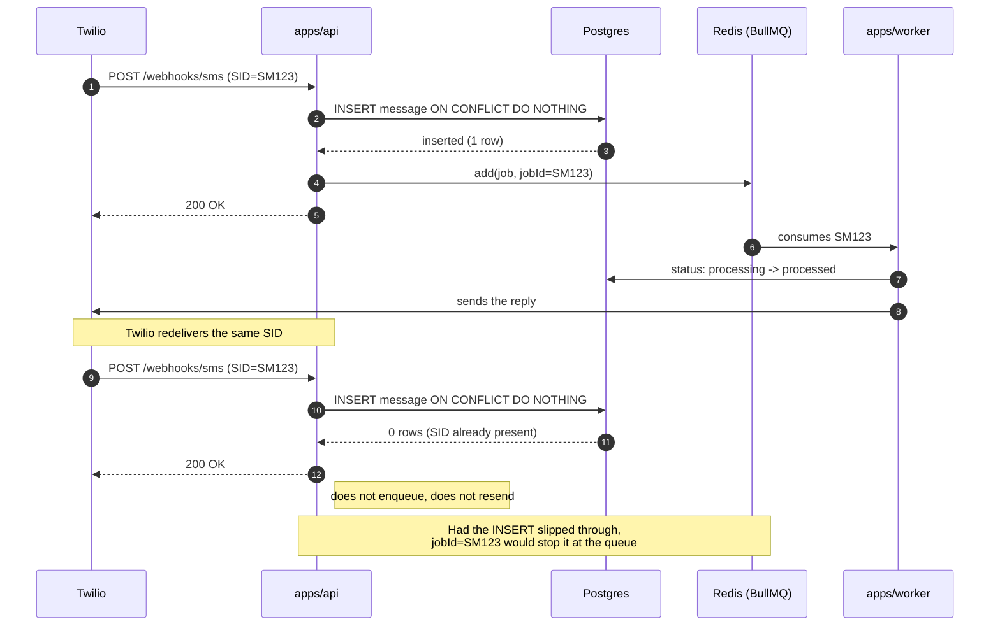
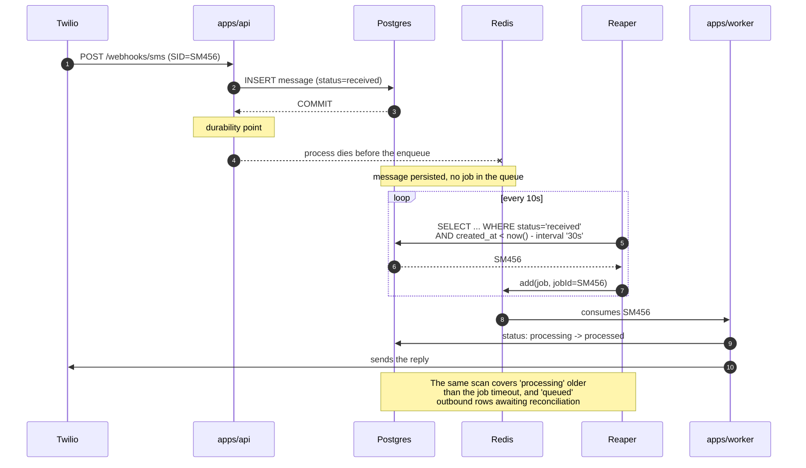
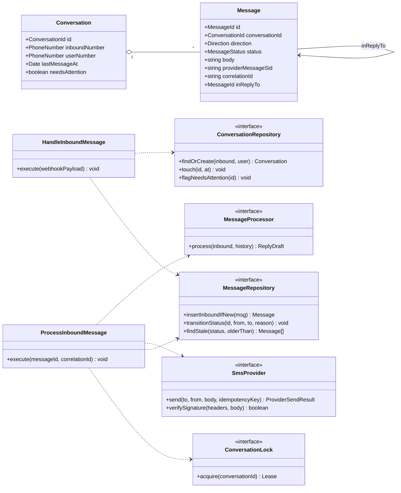
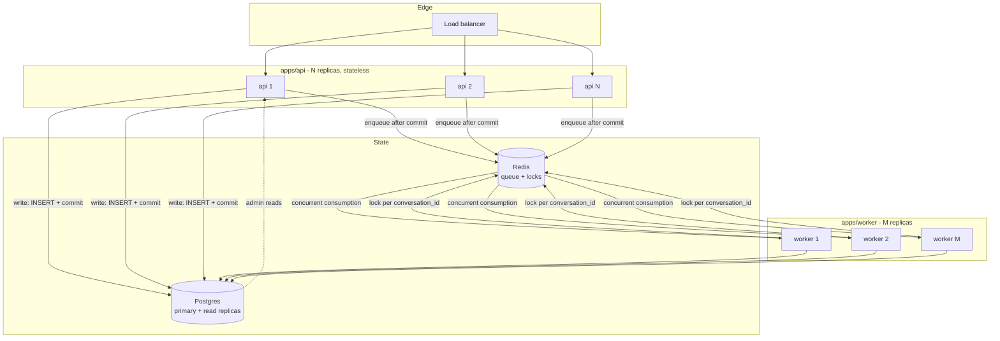

# Diagrams

Diagrams 1–4 live embedded in [ARCHITECTURE.md](../ARCHITECTURE.md), where they answer the
points the brief asks for directly. This file holds the supporting ones: internal mechanisms and
how the design evolves under scale.

The Mermaid here and in `ARCHITECTURE.md` is the source of truth. When the design changes, change
these blocks in the same commit as the code.

---

## 5. Duplicate webhook delivery

Visual proof of ADR-0004: the two deduplication layers, and the rule that redelivery never
resends.

---

## 6. Crash between commit and enqueue, and the reaper

Visual proof of ADR-0005. The durability point is the Postgres commit; Redis is acceleration.

---

## 7. `packages/core` — ports and adapters

The domain imports neither Fastify, nor Drizzle, nor the Twilio SDK. Everything crossing the
boundary is an interface declared here and implemented outside.

Adapters live outside `core`: `DrizzleMessageRepository`, `TwilioSmsProvider`, `FakeSmsProvider`,
`RedisConversationLock`, `RuleBasedMessageProcessor`. Swapping the processor for an LLM is
swapping one implementation of `MessageProcessor`.

---

## 8. Scale: what multiplies

What changes as volume rises, and why the per-Conversation lock is what lets the worker scale
horizontally without breaking reply order.

**Why the lock is not a bottleneck:** it is keyed by `conversation_id`, not global. With 10,000
active conversations and 50 workers, contention only appears when two messages of the *same*
conversation are in flight — exactly the case we want serialized. The cost is one `SET NX` per
job.

**What breaks first:** the Postgres connection pool, because each worker holds a connection
through the 3–15 s of processing. Immediate mitigation: do not hold a transaction open during
processing — open, mark `processing`, close; process; open again to write the result.

**Expected bottlenecks, in order:** Postgres connections (use pgbouncer) → provider throughput
(rate limit per Inbound Number) → the `messages` table (partition by `created_at`).
